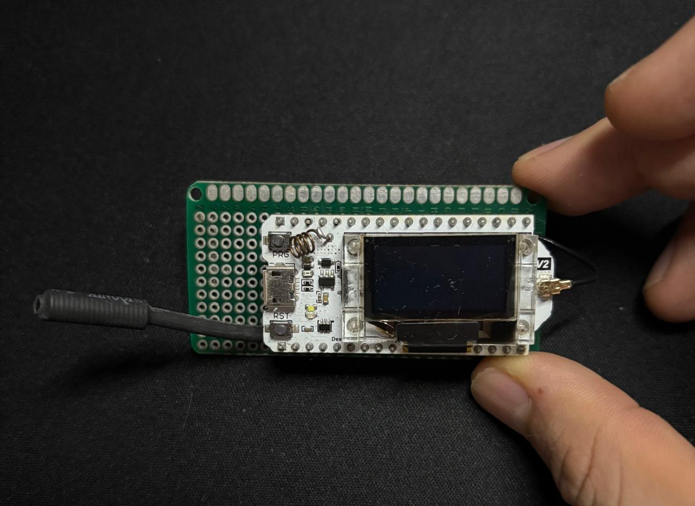
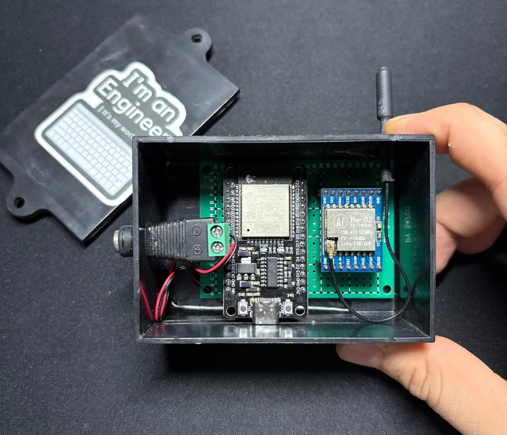
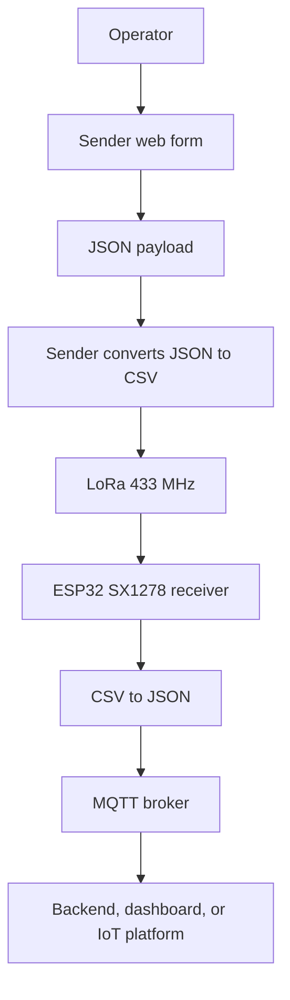

# ESP32 Heltec LoRa Sender

This project uses a Heltec WiFi LoRa 32 V2 board to create an ESP32-based LoRa sender. The device acts as a local Wi‑Fi access point, serves a web form for capturing material-loading data, and sends the collected information through LoRa to the companion ESP32 receiver/gateway project.

## Overview

The application is designed for an industrial or logistics use case:

- an operator enters a material loading order,
- the data is captured through a web interface,
- the ESP32 validates the incoming JSON,
- converts it into CSV format,
- and transmits it over LoRa using a configurable frequency.

The sender works as a standalone data collection and transmission station without needing internet access or an external server. The receiver completes the end-to-end flow by converting the LoRa CSV payload into JSON and publishing it to MQTT.

## Prototype

### Sender



### Receiver



---

## Key features

- ESP32 + Heltec WiFi LoRa 32 V2
- Automatic Wi‑Fi access point mode
- Embedded web form for data entry
- JSON reception via HTTP POST
- Conversion to CSV format for transmission
- LoRa send operation on 433 MHz band
- OLED display for system monitoring
- Unique device ID generated from the ESP32 MAC address
- Packet counter for transmitted messages
- Compatible with the companion ESP32 SX1278 receiver/gateway

---

## System architecture



The companion receiver project is located at `Esp32-SX1247B-LoRa-Receiver`. Its current implementation uses an ESP32 DevKit V1 with an SX1278-compatible LoRa module, receives the sender payload, adds radio diagnostics, and publishes the resulting JSON through MQTT.

---

## Hardware requirements

- Board: Heltec WiFi LoRa 32 V2
- LoRa frequency: 433 MHz
- Compatible LoRa antenna
- USB power supply or suitable ESP32 power source
- Companion receiver: ESP32 DevKit V1 with an SX1278-compatible LoRa module

---

## Software requirements

- [PlatformIO](https://platformio.org/)
- Visual Studio Code (recommended)
- PlatformIO extension for VS Code
- Libraries used in the project:
  - `sandeepmistry/LoRa`
  - `bblanchon/ArduinoJson`
  - `esphome/AsyncTCP-esphome`
  - `esphome/ESPAsyncWebServer-esphome`
  - `eiannone/Heltec_Esp32_Display`
  - `arkhipenko/TaskScheduler`

---

## Project structure

```text
.
├── include/
│   ├── Board.h
│   ├── Config.h
│   ├── Context.h
│   ├── htmlPages.h
│   └── README
├── lib/
│   └── README
├── src/
│   ├── Board.cpp
│   ├── Functions.hpp
│   └── main.cpp
├── web/
│   ├── 404.html
│   └── form.html
├── .gitignore
├── platformio.ini
├── README.md
└── test/
    └── README
```

### Relevant files

- `platformio.ini`: PlatformIO configuration and libraries
- `src/main.cpp`: program entry point and system startup
- `src/Functions.hpp`: LoRa and web server logic
- `include/Config.h`: device, LoRa, and Wi‑Fi parameters
- `include/htmlPages.h`: embedded HTML interface
- `include/Context.h`: global runtime state storage

---

## Network and LoRa configuration

The main configuration is in [include/Config.h](include/Config.h):

```cpp
#define LORA_SS 18
#define LORA_RST 14
#define LORA_DIO0 26
#define LORA_BAND 433E6

#define DEFAULT_WIFI_AP_SSID "LoRa-Sender-Server"
#define DEFAULT_WIFI_AP_PASSWORD "12345678"
```

### Sender and receiver compatibility

The sender and receiver must use the same LoRa radio settings:

| Parameter | Sender | Receiver |
| --- | --- | --- |
| Frequency | 433 MHz | 433 MHz |
| Spreading factor | SF9 | SF9 |
| Signal bandwidth | 125 kHz | 125 kHz |
| Coding rate | 4/5 | 4/5 |
| CRC | Enabled | Enabled |

The pin mappings are board-specific and do not need to match:

- Sender Heltec WiFi LoRa 32 V2: SS `18`, RST `14`, DIO0 `26`
- Receiver ESP32 + SX1278 module: SS `5`, RST `14`, DIO0 `26`

The receiver expects a 14-field CSV payload in this order:

```text
ts,ent,mat,dest,orig,qty,val,drv,pl,lp,mach,op,obs,deviceID
```

The sender appends its unique device ID as the final field. The receiver uses that value as the source identifier and adds its own radio metadata, including RSSI, to the JSON published through MQTT.

### Wi‑Fi access point

When the firmware starts, the board creates an AP with these values:

- SSID: `LoRa-Sender-Server`
- Password: `12345678`

You can connect to this network from a phone or PC.

### Web address

The web server responds at the root of the AP and is typically accessed via:

```text
http://192.168.4.1/
```

---

## How to build and flash the firmware

### 1) Open the project

Open the project folder in VS Code with PlatformIO.

### 2) Install dependencies

PlatformIO will automatically download the libraries declared in `platformio.ini`.

### 3) Build

```bash
pio run
```

### 4) Upload the firmware

```bash
pio run --target upload
```

### 5) Open the serial monitor

```bash
pio device monitor
```

---

## How to use the project

### Step 1: Connect to the Wi‑Fi AP

Connect to the network created by the ESP32:

```text
SSID: LoRa-Sender-Server
PASSWORD: 12345678
```

### Step 2: Open the web form

Open the browser and go to:

```text
http://192.168.4.1/
```

The material loading order form will be displayed.

### Step 3: Fill in the data

The form includes fields such as:

- entity
- material
- destination
- origin
- quantity
- value
- driver
- plate number
- supplier
- machine
- operator
- observations

### Step 4: Send the data

When you press “Send”, the browser builds a JSON object and sends it to the endpoint:

```text
POST /submit
```

The ESP32 receives the request and prepares it for LoRa transmission.

---

## Example JSON payload

```json
{
  "ts": 1720000000,
  "ent": "Constructora Andes S.A.",
  "mat": "Grava",
  "dest": "Obra Vial Los Robles",
  "orig": "Cantera El Progreso",
  "qty": 12.5,
  "val": 350000,
  "drv": "Carlos Pérez",
  "pl": "ABC123",
  "lp": "Transportes del Sur",
  "mach": "CAT320D",
  "op": "Juan Gómez",
  "obs": "Carga verificada en sitio por el operador"
}
```

---

## LoRa transmission and receiver output

After it is received, the data is converted into a CSV line. Example output:

```text
1720000000,Constructora Andes S.A.,Grava,Obra Vial Los Robles,Cantera El Progreso,12.50,350000,Carlos Pérez,ABC123,Transportes del Sur,CAT320D,Juan Gómez,Carga verificada en sitio por el operador,ESP32LORA123456
```

The final identifier `ESP32LORA123456` corresponds to the unique device ID generated from the ESP32 chip.

After receiving the CSV, the companion receiver publishes a JSON message to its configured MQTT topic. Its default configuration uses:

- MQTT broker: `broker.emqx.io`
- MQTT port: `1883`
- Publish topic: `apolo/data/test`

The receiver adds device and radio information similar to:

```json
{
  "device": {
    "id": "ESP32LORA654321",
    "from": "ESP32LORA123456",
    "tx": "LoRa",
    "rssi": -85,
    "unit": "dbm"
  }
}
```

---

## Important considerations

- The LoRa frequency of the transmitter and receiver must match.
- The LoRa modulation parameters must match on both devices: SF9, 125 kHz bandwidth, coding rate 4/5, and CRC enabled.
- The Wi‑Fi network created by the ESP32 is for local access only, not general internet use.
- This project is intended for closed or local data transmission environments.
- The OLED screen is only for monitoring; it does not replace the serial monitor.
- The serial monitor should be used for debugging and internal event checks.
- The receiver needs Wi‑Fi access to reach the MQTT broker; LoRa itself does not provide internet connectivity.
- The receiver's default MQTT broker is public test infrastructure and should be replaced for production use.

---

## Key firmware functions

### `setup()`

In `src/main.cpp`, the following are performed:

- serial port initialization,
- native LED configuration,
- device ID generation,
- OLED display startup,
- LoRa module initialization,
- web server startup.

### `loop()`

The main loop updates the display and remains ready to process incoming web requests.

### `handlePostData()`

This is the main receive-and-send function:

- receives the JSON from the form,
- validates its structure,
- builds the CSV line,
- transmits the packet over LoRa,
- responds to the client with `ok` or `fail` status.

### Receiver responsibilities

The companion receiver:

- listens for LoRa packets,
- measures RSSI, SNR, and frequency error,
- converts the fixed-format CSV payload to JSON,
- connects to Wi‑Fi using stored credentials or WiFiManager,
- and publishes the JSON to MQTT.

---

## Possible future improvements

- add receiver ACK support for LoRa,
- support multiple payload types,
- local storage in flash memory,
- data encryption,
- automatic periodic packet sending,
- richer web dashboard,
- support for additional sensors (temperature, humidity, level, etc.).

---

## License

This project is provided as an example for educational and prototyping use. If you use it in production, review and adapt the logic according to your security, validation, and operational requirements.

---

## Credits

Project developed for the Heltec WiFi LoRa 32 V2 board and based on PlatformIO + Arduino.
